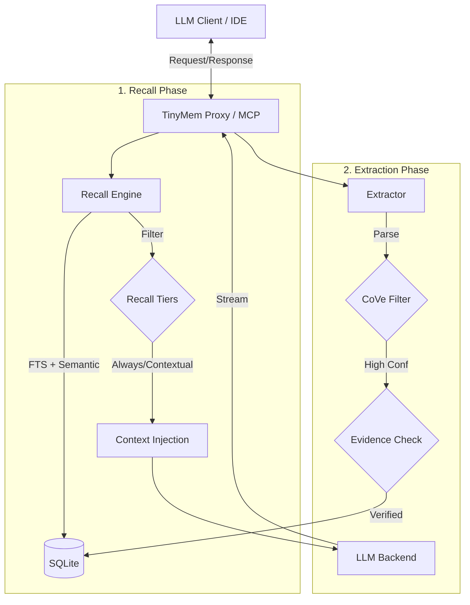

# tinyMem

<div align="center">
  

  <p>
    <a href="https://github.com/andrzejmarczewski/tinyMem/blob/main/LICENSE">
      
    </a>
    <a href="https://go.dev/dl/">
      
    </a>
    
  </p>

  <h3>Local, project-scoped memory system for language models with evidence-based truth validation.</h3>
</div>

---

tinyMem gives small and medium language models (7B–13B) reliable long-term memory in complex codebases. It sits between you and the LLM, injecting verified context and capturing validated facts—all locally, without model retraining or cloud dependencies.

## 📖 Table of Contents

- [Purpose](#-purpose)
- [Key Features](#-key-features)
- [Quick Start](#-quick-start)
- [Installation](#-installation)
- [Usage](#-usage)
  - [CLI Commands](#cli-commands)
  - [Writing Memories](#writing-memories)
  - [Memory Types & Truth](#memory-types--truth)
- [The Ralph Loop](#-the-ralph-loop-autonomous-repair)
- [Integration](#-integration)
  - [Proxy Mode](#proxy-mode)
  - [MCP Server (IDE Integration)](#mcp-server-ide-integration)
  - [AI Agent Directives](#ai-agent-directives)
- [Architecture](#-architecture)
- [Token Economics](#-token-efficiency--economics)
- [Configuration](#-configuration)
- [Development](#-development)
- [Contributing](#-contributing)
- [License](#-license)

---

## 🎯 Purpose

Language models forget context, hallucinate, and don't verify their own answers. **tinyMem** solves this by:
1.  **Injecting Context**: Deterministic, token-budgeted context so models "remember" decisions.
2.  **Enforcing Truth**: Claims become facts *only* when locally verified (files, greps, tests).
3.  **Local Privacy**: Stays entirely on your machine. No cloud lock-in.

### Philosophy
1.  **Memory is not gospel**: Model output is never trusted by default.
2.  **Facts require evidence**: Claims without verification stay as claims.
3.  **Reality checks are free**: We use local tools (grep, tests) to verify reality.

---

## ✨ Key Features

*   **Evidence-Based Truth**: Typed memories (`fact`, `claim`, `decision`, etc.). Only verified claims become facts.
*   **Chain-of-Verification (CoVe)**: Optional LLM-based quality filter to reduce hallucinations before storage.
*   **Local & Private**: Runs as a single binary. Data lives in `.tinyMem/`.
*   **Zero Configuration**: Works out of the box.
*   **Dual Mode**: Works as an HTTP Proxy or Model Context Protocol (MCP) server.
*   **Hybrid Search**: FTS (lexical) + Optional Semantic Search.
*   **Recall Tiers**: Prioritizes `Always` (facts) > `Contextual` (decisions) > `Opportunistic` (notes).

---

## 🚀 Quick Start

Get up and running in seconds.

### 1. Initialize
Go to your project root and initialize the memory database:
```bash
cd /path/to/your/project
tinymem health
```

### 2. Run
Start the server (choose one mode):

**Option A: Proxy Mode** (for generic LLM clients)
```bash
tinymem proxy
# Then point your client (e.g., OpenAI SDK) to http://localhost:8080/v1
```

**Option B: MCP Mode** (for Claude Desktop, Cursor, VS Code)
```bash
tinymem mcp
# Configure your IDE to run this command
```

---

## 📦 Installation

See the [Quick Start Guide for Beginners](docs/QUICK_START_GUIDE.md) for a detailed walkthrough.

### Option 1: Pre-built Binary (Recommended)
Download from the [Releases Page](https://github.com/andrzejmarczewski/tinyMem/releases).

**macOS / Linux**:
```bash
curl -L "https://github.com/andrzejmarczewski/tinyMem/releases/latest/download/tinymem-$(uname -s | tr '[:upper:]' '[:lower:]')-$(uname -m)" -o tinymem
chmod +x tinymem
sudo mv tinymem /usr/local/bin/
```

**Windows**:
Download `tinymem-windows-amd64.exe`, rename to `tinymem.exe`, and add to your system `PATH`.

### Option 2: Build from Source
Requires Go 1.25.6+.
```bash
git clone https://github.com/andrzejmarczewski/tinyMem.git
cd tinyMem
./build/build.sh   # macOS/Linux
# or
.\build\build.bat  # Windows
```

---

## 💻 Usage

### CLI Commands
```bash
# Core
tinymem health          # Initialize/Check system
tinymem stats           # View memory statistics
tinymem dashboard       # Visual snapshot of memory state

# Memory Operations
tinymem query "auth"    # Search memories
tinymem recent          # Show recent entries
tinymem write ...       # Manually add memory (see below)

# Modes
tinymem proxy           # Start HTTP proxy
tinymem mcp             # Start MCP server

# Utilities
tinymem addContract     # Add protocol to agent config files
```

### Writing Memories
```bash
# Add a simple note
tinymem write --type note --summary "Refactoring user API"

# Add a high-value decision
tinymem write --type decision --summary "Use PostgreSQL" \
  --detail "Needed for JSONB support" \
  --source "Architecture Review"
```

### Memory Types & Truth

| Type | Evidence Required? | Truth State | Recall Tier |
|------|--------------------|-------------|-------------|
| **Fact** | ✅ Yes | Verified | Always |
| **Decision** | ✅ Yes (Confirmation) | Asserted | Contextual |
| **Constraint** | ✅ Yes | Asserted | Always |
| **Claim** | ❌ No | Tentative | Contextual |
| **Plan** | ❌ No | Tentative | Opportunistic |

*Evidence types supported: `file_exists`, `grep_hit`, `cmd_exit0`, `test_pass`.*

---

## 🤖 The Ralph Loop (Autonomous Repair)

The **Ralph Loop** (`memory_ralph`) is a deterministic governor for autonomous codebase repair. Once triggered, tinyMem takes control, iterating until evidence passes or limits are reached.

### 🔄 Execution Phases
| Phase | Action | Purpose |
|-------|--------|---------|
| **Execute** | Run Command | Executes the target verification (e.g., `go test`). |
| **Evidence** | Validate | Checks predicates (`test_pass`, `file_exists`). |
| **Recall** | Search | Retrieves failure patterns from long-term memory. |
| **Repair** | Apply Fix | tinyMem's internal LLM applies code changes. |

### 📜 Execution Contract
- **Evidence is King**: Only successful evidence checks can terminate the loop.
- **Safety First**: Supports path blacklisting (`forbid_paths`) and command blocking.
- **Durable Memory**: The loop results are stored even if the agent is reset.

---

## 🔌 Integration

### Proxy Mode
Intercepts standard OpenAI-compatible requests.
```bash
export OPENAI_API_BASE_URL=http://localhost:8080/v1
# Your existing scripts now use tinyMem automatically
```

### MCP Server (IDE Integration)
Compatible with Claude Desktop, Cursor, and other MCP clients.

**Claude Desktop Configuration** (`claude_desktop_config.json`):
```json
{
  "mcpServers": {
    "tinymem": {
      "command": "/absolute/path/to/tinymem",
      "args": ["mcp"]
    }
  }
}
```
*Run `./verify_mcp.sh` to validate your setup.*

#### Available MCP Tools:
- `memory_query` - Search memories using full-text or semantic search
- `memory_recent` - Retrieve the most recent memories
- `memory_write` - Create a new memory entry with optional evidence
- `memory_stats` - Get statistics about stored memories
- `memory_health` - Check the health status of the memory system
- `memory_doctor` - Run diagnostics on the memory system
- `memory_ralph` - Execute an autonomous evidence-gated repair loop

### AI Agent Directives
**CRITICAL**: If you are building an AI agent, you MUST include the appropriate directive in its system prompt to ensure it uses tinyMem correctly.

**Quick Setup:** Run `tinymem addContract` to automatically create these files in your project.

*   **Claude**: [`docs/agents/CLAUDE.md`](docs/agents/CLAUDE.md)
*   **Gemini**: [`docs/agents/GEMINI.md`](docs/agents/GEMINI.md)
*   **Qwen**: [`docs/agents/QWEN.md`](docs/agents/QWEN.md)
*   **Other**: [`docs/agents/AGENT_CONTRACT.md`](docs/agents/AGENT_CONTRACT.md)

---

## 🏗 Architecture



### File Structure
```
.
├── .tinyMem/             # Project-scoped storage (DB, logs, config)
├── assets/               # Logos and icons
├── build/                # Build scripts
├── cmd/                  # Application entry points
├── docs/                 # Documentation & Agent Contracts
├── internal/             # Core logic (Memory, Evidence, Recall)
└── README.md             # This file
```

## 📉 Token Efficiency & Economics

tinyMem uses more tokens per minute but **significantly fewer tokens per task** compared to standard agents.

| Feature | Token Impact | Why? |
| :--- | :--- | :--- |
| **Recall Engine** | 📉 **Saves** | Replaces "Read All Files" with targeted context snippets. |
| **Context Reset** | 📉 **Saves** | Prevents chat history from snowballing by starting iterations fresh. |
| **Truth Discipline**| 📉 **Saves** | Stops expensive "hallucination rabbit holes" before they start. |
| **Ralph Loop** | 📈 **Uses** | Requires multiple internal completions to reach autonomous success. |

**The Verdict:** tinyMem acts as a "Sniper Rifle" for context. By ensuring the few tokens sent are the *correct* ones, it avoids the massive waste of re-reading files and un-breaking hallucinated code.

---

## ⚙ Configuration

Zero-config by default. Override in `.tinyMem/config.toml`:

```toml
[recall]
max_items = 10
semantic_enabled = false # Set true if you have an embedding model

[cove]
enabled = true           # Chain-of-Verification
confidence_threshold = 0.6
```

See [Configuration Docs](docs/QUICK_START_GUIDE.md) for details.

---

## 🛠 Development

```bash
# Run tests
go test ./...

# Build
./build/build.sh
```
See [Task Management](docs/tinyTasks.md) for how we track work.

---

## 🤝 Contributing

We value truth and reliability.
1.  **Truth Discipline**: No shortcuts on verification.
2.  **Streaming**: No buffering allowed.
3.  **Tests**: Must pass `go test ./...`.

See [CONTRIBUTING.md](CONTRIBUTING.md).

---

## 📄 License

[MIT](LICENSE) © 2026 Andrzej Marczewski
