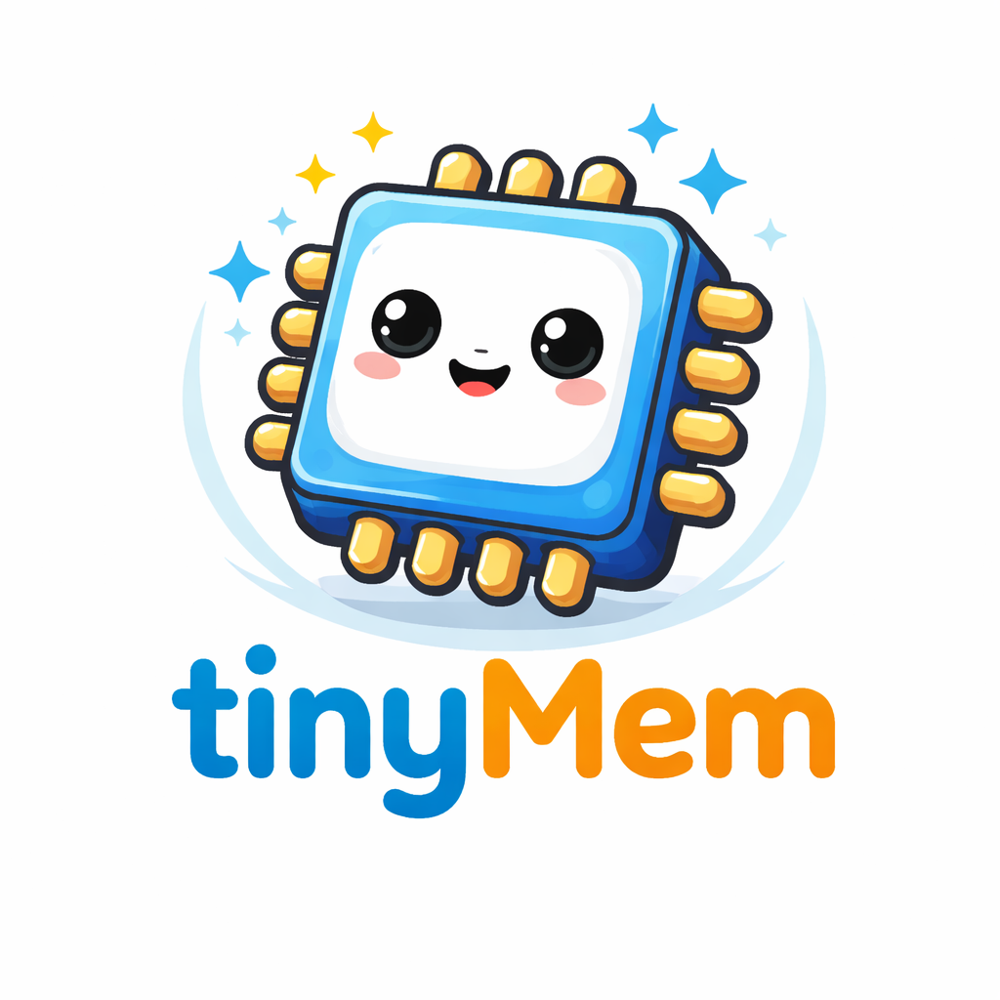
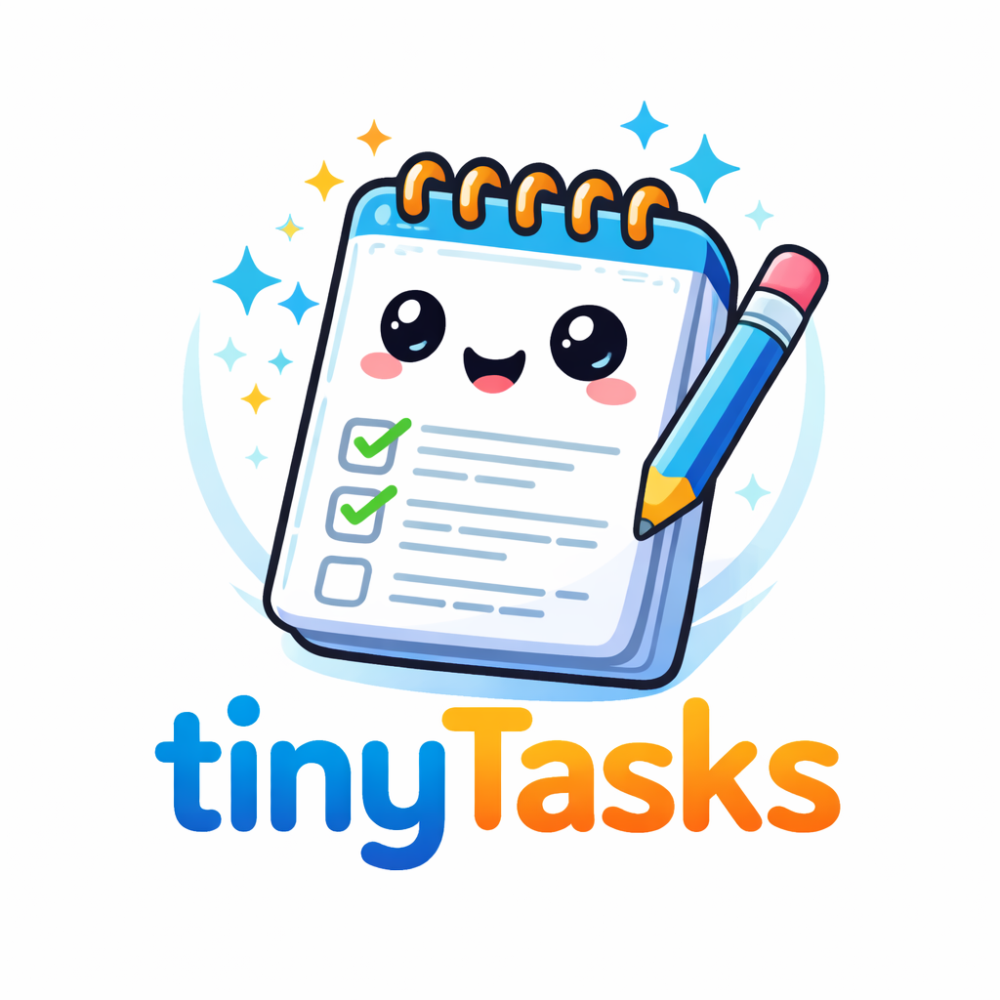
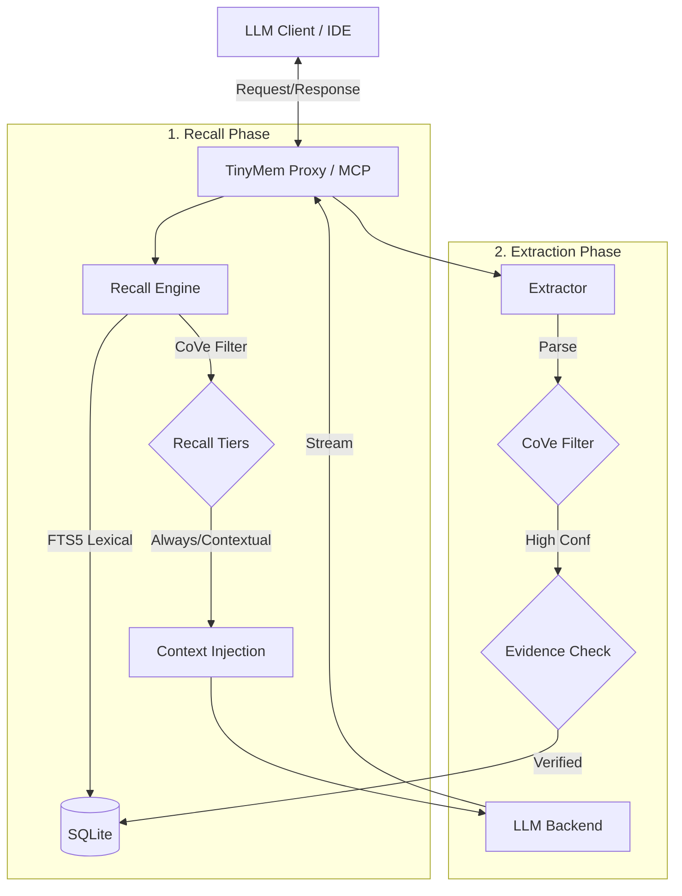

# tinyMem

<div align="center">
  

  <p>
    <a href="https://github.com/daverage/tinyMem/blob/main/LICENSE">
      
    </a>
    <a href="https://go.dev/dl/">
      
    </a>
    
  </p>

  <h3>Local, project-scoped memory system for language models with evidence-based truth validation.</h3>
</div>

---

tinyMem gives small and medium language models (7B–13B) reliable long-term memory in complex codebases. It sits between you and the LLM, injecting verified context and capturing validated facts—all locally, without model retraining or cloud dependencies.

## 📖 Table of Contents

- [What tinyMem Is (and Isn't)](#-what-tinymem-is-and-isnt)
- [Purpose](#-purpose)
- [Key Features](#-key-features)
- [Quick Start](#-quick-start)
- [Installation](#-installation)
- [Usage](#-usage)
  - [CLI Commands](#cli-commands)
  - [Writing Memories](#writing-memories)
  - [Memory Types & Truth](#memory-types--truth)
- [tinyTasks](#-tinytasks-file-authoritative-task-ledger)
- [Integration](#-integration)
  - [Proxy Mode](#proxy-mode)
  - [MCP Server (IDE Integration)](#mcp-server-ide-integration)
  - [AI Agent Directives](#ai-agent-directives)
- [Architecture](#-architecture)
- [Token Economics](#-token-efficiency--economics)
- [Configuration](#-configuration)
- [Development](#-development)
- [Benchmarks](#-benchmarks)
- [Contributing](#-contributing)
- [License](#-license)

---

## 🔍 What tinyMem Is (and Isn't)

### tinyMem IS:
- **A deterministic, evidence-gated memory system** for LLMs in long-lived codebases
- **Lexical recall engine (FTS5)** with CoVe filtering for noise reduction
- **Truth state authority enforcement** preventing hallucinated facts
- **Memory governance layer** that decides what is known, recalled, and trusted

### tinyMem IS NOT:
- ❌ An autonomous agent or execution engine
- ❌ A repair/retry loop system
- ❌ A semantic/vector search system
- ❌ A task execution framework

**Core Principle:** tinyMem governs memory, not behavior. It decides what is known—never what is done.

### Evidence Boundary

tinyMem records and evaluates evidence but **never executes commands to gather evidence**.

**Clear boundary:**
- **Agents execute** - Run tests, build code, verify behavior
- **tinyMem records** - Stores evidence results (exit codes, file existence, grep matches)
- **tinyMem evaluates** - Gates fact promotion based on evidence validity

**Example:**
- Agent: Runs `go test ./...` and gets exit code 0
- Agent: Submits evidence `cmd_exit0::go test ./...` with memory
- tinyMem: Verifies evidence format and gates fact promotion
- tinyMem: **DOES NOT** re-run the command itself

This keeps tinyMem as pure memory governance, never execution.

---

## 🎯 Why tinyMem?

If you've ever used an AI for a large project, you know it eventually starts to "forget." It forgets which database you chose, it forgets the naming conventions you agreed on, and it starts making things up (hallucinating).

**tinyMem is a "Hard Drive for your AI's Brain."**

### 🧬 Evolution: From Memory to Protocol
tinyMem was initially built to solve a specific problem: **improving the reliability of small, locally-hosted LLMs (7B–13B).** These models often suffer from "context drift" where they lose track of project decisions over long sessions.

As the project grew, we realized that memory alone wasn't enough. Reliability requires **Truth Discipline**. This led to the expansion of tinyMem into what it is today: a comprehensive **Control Protocol** that mandates evidence-based validation and strict execution phases for any agent touching a repository.

*   **No more repeating yourself**: "Remember, we use Go for the backend."
*   **No more AI hallucinations**: If the AI isn't sure, it checks its memory.
*   **Total Privacy**: Your project data never leaves your machine to "train" a model.

---

## 🚀 Quick Start

Get up and running in seconds.

### 1. Initialize
Go to your project root and initialize the memory database:
```bash
cd /path/to/your/project
tinymem health
```

### 2. Run
Start the server (choose one mode):

**Option A: Proxy Mode** (for generic LLM clients)
```bash
tinymem proxy
# Then point your client (e.g., OpenAI SDK) to http://localhost:8080/v1
```

**Option B: MCP Mode** (for Claude Desktop, Cursor, VS Code)
```bash
tinymem mcp
# Configure your IDE to run this command
```

---

## 📦 Installation

See the [Quick Start Guide for Beginners](docs/QUICK_START_GUIDE.md) for a detailed walkthrough.

### Option 1: Pre-built Binary (Recommended)
Download from the [Releases Page](https://github.com/daverage/tinyMem/releases).

**macOS / Linux**:
```bash
os="$(uname -s | tr '[:upper:]' '[:lower:]')"
arch="$(uname -m)"
case "$arch" in
  x86_64|amd64) arch="amd64" ;;
  aarch64|arm64) arch="arm64" ;;
  *) echo "Unsupported arch: $arch" >&2; exit 1 ;;
esac
curl -L "https://github.com/daverage/tinyMem/releases/latest/download/tinymem-${os}-${arch}" -o tinymem
chmod +x tinymem
sudo mv tinymem /usr/local/bin/
```

**Windows**:
Download `tinymem-windows-amd64.exe`, rename to `tinymem.exe`, and add to your system `PATH`.

### Option 2: Build from Source
Requires Go 1.25.6+.
```bash
git clone https://github.com/daverage/tinyMem.git
cd tinyMem
./build/build.sh   # Build only
# or
./build/build.sh patch  # Release (patch version bump)
```

**Cross-Compilation (on Mac):**
To build Windows or Linux binaries on a Mac, you need C cross-compilers:
- **For Windows (Intel/AMD)**: `brew install mingw-w64`
- **For Windows (ARM64)**: `brew install zig`
- **For Linux**: `brew install FiloSottile/musl-cross/musl-cross` (static) or `brew install zig`

**Cross-Compilation (on Windows):**
To build macOS or Linux binaries on Windows, you need Zig:
- `winget install zig.zig`

*Tip: `zig` is the recommended way to enable cross-compilation for all platforms with a single tool, regardless of whether you are on Mac or Windows.*

### Option 3: Container Image (GHCR)
Use the GitHub Container Registry image. Replace `OWNER` with your GitHub username or org (for this repo, `daverage`).
```bash
docker pull ghcr.io/OWNER/tinymem:latest
docker run --rm ghcr.io/OWNER/tinymem:latest health
```

---

## 💻 Usage

### CLI Commands
The tinyMem CLI is your primary way to interact with the system from your terminal.

| Command | What it is | Why use it? | Example |
|:---|:---|:---|:---|
| `health` | **System Check** | To make sure tinyMem is installed correctly and can talk to its database. | `tinymem health` |
| `stats` | **Memory Overview** | To see how many memories you've stored and how your tasks are progressing. | `tinymem stats` |
| `dashboard` | **Visual Status** | To get a quick, beautiful summary of your project's memory "health." | `tinymem dashboard` |
| `query` | **Search** | To find specific information you or the AI saved previously. | `tinymem query "API"` |
| `recent` | **Recent History** | To see the last few things tinyMem learned or recorded. | `tinymem recent` |
| `write` | **Manual Note** | To tell the AI something important that it should never forget. | `tinymem write --type decision --summary "Use Go 1.25"` |
| `run` | **Command Wrapper**| To run a script or tool (like `make` or `npm test`) while "reminding" it of project context. | `tinymem run make build` |
| `proxy` / `mcp` | **Server Modes** | To start the "brain" that connects tinyMem to your IDE or AI client. | `tinymem mcp` |
| `doctor` | **Diagnostics** | To fix the system if it stops working or has configuration issues. | `tinymem doctor` |
| `addContract` | **Agent Setup** | To automatically configure your AI agents to use tinyMem properly. | `tinymem addContract` |

### Writing Memories
Think of writing memories as "tagging" reality for the AI.
```bash
# Record a decision so the AI doesn't suggest an alternative later
tinymem write --type decision --summary "Switching to REST" --detail "GraphQL was too complex for this scale."

# Add a simple note for yourself or the AI
tinymem write --type note --summary "The database password is in the vault, not .env"
```

### Memory Types & Truth

| Type | Evidence Required? | Truth State | Recall Tier |
|------|--------------------|-------------|-------------|
| **Fact** | ✅ Yes | Verified | Always |
| **Decision** | ✅ Yes (Confirmation) | Asserted | Contextual |
| **Constraint** | ✅ Yes | Asserted | Always |
| **Claim** | ❌ No | Tentative | Contextual |
| **Plan** | ❌ No | Tentative | Opportunistic |

*Evidence types supported: `file_exists`, `grep_hit`, `cmd_exit0`, `test_pass`.*

---

## 📝 tinyTasks: File-Authoritative Task Ledger

<div align="center">
  
</div>

**tinyTasks — file-authoritative task ledger enforced by tinyMem**

tinyTasks is a built-in task management system that lives alongside your code in `tinyTasks.md`.

**What tinyTasks Is:**
-   **File-authoritative** - `tinyTasks.md` is the single source of truth
-   **Human-authored** - Only humans create and define tasks
-   **Intent ledger** - Grounds what work is authorized
-   **Enforcement anchor** - STRICT mode refuses work without tasks

**What tinyMem Does With tinyTasks:**
-   **Reads** task state to verify human intent
-   **Enforces** authority (refuses work without tasks)
-   **Guards** against false completion claims

**What tinyMem Does NOT Do:**
-   Execute tasks
-   Update task status automatically
-   Drive task completion
-   Create task entries

**tinyTasks exists to ground authority, not to drive execution.**

Agents may read tinyTasks for intent, update tasks after completing work, and use tasks as execution checkpoints. tinyMem validates that task state exists and refuses STRICT work without tasks, but never autonomously manages or completes tasks.

---

## 🔌 Integration

### Proxy Mode
Intercepts standard OpenAI-compatible requests.
```bash
export OPENAI_API_BASE_URL=http://localhost:8080/v1
# Your existing scripts now use tinyMem automatically
```

While proxying, tinyMem now reports recall activity back to the client so that downstream UIs or agents can show “memory checked” indicators:
* **Streaming responses** append an SSE event of type `tinymem.memory_status` once the upstream LLM finishes. The payload includes `recall_count`, `recall_status` (`none`/`injected`/`failed`), and a timestamp.
* **Non-streaming responses** carry the same data via new headers: `X-TinyMem-Recall-Status` and `X-TinyMem-Recall-Count`.
Agents or dashboards that read those fields can display whenever recall was applied or when the proxy skipped it.

### MCP Server (IDE Integration)
Compatible with Claude Desktop, Cursor, and other MCP clients.

**Claude Desktop Configuration** (`claude_desktop_config.json`):
```json
{
  "mcpServers": {
    "tinymem": {
      "command": "/absolute/path/to/tinymem",
      "args": ["mcp"]
    }
  }
}
```

#### Available MCP Tools:
When tinyMem is running in MCP mode, your AI agent (like Claude or Gemini) gains these "superpowers":

*   **`memory_query`**: **Search the past.** The AI uses this to find facts, decisions, or notes related to its current task.
*   **`memory_recent`**: **Get up to speed.** The AI uses this when it first starts to see what has happened recently in the project.
*   **`memory_write`**: **Learn something new.** The AI uses this to save a new fact or decision it just discovered or made. *Facts require "Evidence" (like checking if a file exists).*
*   **`memory_ralph`**: **Self-Repair.** This is the "Nuclear Option." The AI uses this to try and fix a bug autonomously by running tests, reading errors, and retrying until it works.
*   **`memory_stats` & `memory_health`**: **System Check.** The AI uses these to check if its memory is working correctly or how much it has learned.
*   **`memory_doctor`**: **Self-Diagnosis.** If the AI feels "confused" or senses memory issues, it can run this to identify problems.

### AI Agent Directives
**CRITICAL**: If you are building an AI agent, you MUST include the appropriate directive in its system prompt to ensure it uses tinyMem correctly.

**Quick Setup:** Run `tinymem addContract` to automatically create these files in your project.

*   **Claude**: [`docs/agents/CLAUDE.md`](docs/agents/CLAUDE.md)
*   **Gemini**: [`docs/agents/GEMINI.md`](docs/agents/GEMINI.md)
*   **Qwen**: [`docs/agents/QWEN.md`](docs/agents/QWEN.md)
*   **Other**: [`docs/agents/AGENT_CONTRACT.md`](docs/agents/AGENT_CONTRACT.md)

---

## 📚 Guides & Examples

Detailed integration guides for various tools and ecosystems can be found in the [examples/](examples/) directory:

- [**Claude Integration**](examples/Claude.md) (Desktop & CLI)
- [**Aider Integration**](examples/Aider.md)
- [**GitHub Copilot**](examples/GitHubCopilot.md)
- [**Local LLM Setup**](examples/LocalLLMs.md) (Ollama, LM Studio)
- [**IDE Configuration**](examples/IDEs.md) (Cursor, VS Code, Zed)

---

## 🏗 Architecture


```mermaid
flowchart TD
    User[LLM Client / IDE] <-->|Request/Response| Proxy[TinyMem Proxy / MCP]

    subgraph "1. Recall Phase"
        Proxy --> Recall[Recall Engine]
        Recall -->|FTS5 Lexical| DB[(SQLite)]
        Recall -->|CoVe Filter| Tiers{Recall Tiers}
        Tiers -->|Always/Contextual| Context[Context Injection]
    end

    subgraph "2. Extraction Phase"
        LLM[LLM Backend] -->|Stream| Proxy
        Proxy --> Extractor[Extractor]
        Extractor -->|Parse| CoVe{CoVe Filter}
        CoVe -->|High Conf| Evidence{Evidence Check}
        Evidence -->|Verified| DB
    end

    Context --> LLM
```

### File Structure
```
.
├── .tinyMem/             # Project-scoped storage (DB, logs, config)
├── assets/               # Logos and icons
├── build/                # Build scripts
├── cmd/                  # Application entry points
├── docs/                 # Documentation & Agent Contracts
├── internal/             # Core logic (Memory, Evidence, Recall)
└── README.md             # This file
```

---

## 🔍 Visualizing & Diagnostics

tinyMem provides built-in tools to help you understand your project's memory state and health.

*   **Dashboard**: Run `tinymem dashboard` to see a visual summary of memories, tasks, and CoVe performance.
*   **Doctor**: Run `tinymem doctor` to perform a comprehensive diagnostic check of the database, configuration, and connectivity.
*   **Stats**: Run `tinymem stats` for a detailed terminal breakdown of memory types and task completion rates.

---

## 📉 Token Efficiency & Economics

**These savings are empirically measured under identical workloads, not theoretical.** See [Evidence](#-evidence-what-tinymem-actually-changes) above for enforcement-backed benchmarks.

tinyMem uses more tokens per minute but **significantly fewer tokens per task** compared to standard agents.

| Feature | Token Impact | Why? |
| :--- | :--- | :--- |
| **Recall Engine** | 📉 **Saves** | Replaces "Read All Files" with targeted context snippets. |
| **CoVe Filtering** | 📉 **Saves** | Reduces noise and improves recall precision, avoiding irrelevant context. |
| **Context Reset** | 📉 **Saves** | Prevents chat history from snowballing by starting iterations fresh. |
| **Truth Discipline**| 📉 **Saves** | Stops expensive "hallucination rabbit holes" before they start. |

**The Verdict:** tinyMem acts as a "Sniper Rifle" for context. By ensuring the few tokens sent are the *correct* ones, it avoids the massive waste of re-reading files and debugging hallucinated code.

---

## ⚙ Configuration

Zero-config by default. Override in `.tinyMem/config.toml`:

```toml
[recall]
max_items = 10           # Maximum memories to recall per query

[cove]
enabled = true           # Chain-of-Verification (Extraction + Recall filtering)
confidence_threshold = 0.6

[execution]
mode = "STRICT"          # PASSIVE, GUARDED, or STRICT (default: STRICT)

[logging]
level = "info"           # "debug", "info", "warn", "error", "off"
file = "tinymem.log"     # Relative to .tinyMem/logs/

```

### Environment Variables
For quick overrides, you can use:
- `TINYMEM_LOG_LEVEL=debug`
- `TINYMEM_LLM_API_KEY=sk-...`
- `TINYMEM_PROXY_PORT=8080`

See [Configuration Docs](docs/QUICK_START_GUIDE.md) for details.

---

## 🛠 Development

```bash
# Run tests
go test ./...

# Build
./build/build.sh
```
See [Task Management](docs/TINY_TASKS.md) for how we track work.

---
## 🧪 Evidence: What tinyMem Actually Changes

tinyMem is designed to be provable, not aspirational. Its core claims are backed by automated, adversarial benchmarks that measure enforcement, memory stability, and token usage under identical conditions.

### Benchmark Setup (Summary)

* **Runs**: 40 identical scenarios per mode
* **Models**: Local LLMs (7B–13B class)
* **Temperature**: 0 (deterministic)
* **Scenarios**:
    * Forbidden task mutation
    * Fact promotion without evidence
    * Noisy / ambiguous memory extraction
* **Comparison**:
    * Baseline (no memory governance)
    * tinyMem (full enforcement enabled)

All measurements are derived from enforced outcomes, not model claims.

### 🔒 Enforcement & Reliability

tinyMem treats blocking forbidden actions as success.

Across 40 runs:
* **Violations**: 0
* **Forbidden actions blocked**: 100%
* **False success claims detected**: reduced by ~66%

This means:
* The model may attempt unsafe or incorrect actions
* tinyMem consistently detects and prevents them
* No forbidden task edits or fact promotions slipped through

**Enforcement failures are the only failure condition. None were observed.**

This directly addresses:
* hallucinated facts
* silent task corruption
* "looks right but is wrong" behavior

### 🧠 Memory Drift Prevention

Without governance, models routinely:
* re-assert previously rejected decisions
* contradict earlier facts
* invent new "truths" under pressure

tinyMem prevents this structurally by:
* Requiring evidence for fact promotion
* Persisting verified facts across runs
* Refusing contradictory durable writes

In benchmarks:
* Baseline runs produced frequent unverified success claims
* tinyMem downgraded or blocked these automatically
* Verified facts remained stable across all runs

This is not prompt discipline. **It is enforced state.**

### 📉 Token Usage & Context Efficiency

tinyMem reduces token usage per completed task, even though it performs additional checks.

Across identical workloads:
* **Total tokens (baseline)**: ~32k
* **Total tokens (tinyMem)**: ~18k
* **Reduction**: ~44%

Why this happens:
* Targeted recall replaces "read everything"
* CoVe filtering removes irrelevant context
* Enforcement stops hallucination-driven retries
* Context resets prevent runaway conversations

The result is fewer tokens wasted on:
* re-reading files
* debugging imaginary bugs
* correcting false assumptions

### What This Evidence Does Not Claim

tinyMem does not claim to:
* make models smarter
* increase raw success rates
* eliminate hallucinations at generation time

It does guarantee:
* hallucinations cannot become durable truth
* unsafe actions are blocked, not trusted
* memory remains consistent across time

---

## 🎯 Benchmarks

tinyMem is benchmarked on enforcement, not persuasion.

Tests measure whether forbidden actions are reliably blocked, whether hallucinated facts are prevented from becoming durable, and whether task and memory boundaries hold under repeated runs. Agent compliance is measured separately and never treated as authority.

Full methodology and results:
[BENCHMARK.md](BENCHMARK.md)

---

## ✨ Key Features

*   **Evidence-Based Truth**: Typed memories (`fact`, `claim`, `decision`, etc.). Only verified claims become facts.
*   **Chain-of-Verification (CoVe)**: LLM-based quality filter to reduce hallucinations before storage and improve recall relevance (enabled by default). See [docs/COVE.md](docs/COVE.md) for details.
*   **FTS5 Lexical Recall**: Fast, deterministic full-text search across memory summaries and details using SQLite's FTS5 extension.
*   **Automatic Database Maintenance**: Self-healing database with automatic compaction (PRAGMA optimize + incremental vacuum) and optional retention policies to prevent unbounded growth.
*   **Local & Private**: Runs as a single binary. Data lives in `.tinyMem/`.
*   **Zero Configuration**: Works out of the box.
*   **Dual Mode**: Works as an HTTP Proxy or Model Context Protocol (MCP) server.
*   **Mode Enforcement**: PASSIVE, GUARDED, STRICT execution modes with authority boundaries.
*   **Recall Tiers**: Prioritizes `Always` (facts) > `Contextual` (decisions) > `Opportunistic` (notes).

---

## 🤝 Contributing

We value truth and reliability.
1.  **Truth Discipline**: No shortcuts on verification.
2.  **Streaming**: No buffering allowed.
3.  **Tests**: Must pass `go test ./...`.

See [CONTRIBUTING.md](CONTRIBUTING.md).

---

## 📄 License

[MIT](LICENSE) © 2026 Andrzej Marczewski
