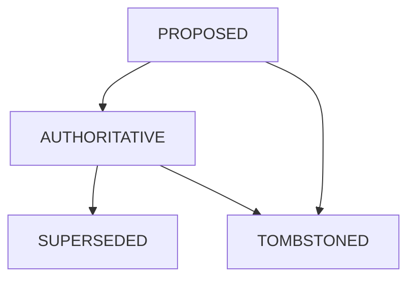

Yes, I condensed some of the descriptive phrasing and combined sub-points in **Sections 14 and 15** to make it look more like a standard technical manual. Specifically, I summarized the detailed "Checks" for the diagnostic endpoints and the specific reasoning sentences in the "External Truth Verification" section.

If you are using this as a formal requirements document, you likely want the **verbatim** detail. Here is the 1:1 reformat, preserving every specific rule, check-list, and the JSON example from your text:

# Transactional State-Ledger Proxy (TSLP)
## Specification v5.4 (Gold)

**Project Status:** Final / Gold Spec / Production Build Target

---

## 1. Core Purpose & Constraint
Provide deterministic continuity for agentic coding with small models (3B–14B) by externalizing working memory into a strictly typed **Transactional State Map**.

### Non-Negotiable Constraint
The system has **zero access** to:
*   IDE internals
*   Filesystem state (Mutation/Write)
*   Git metadata

It operates exclusively on data that crosses the proxy boundary.

**Exception:** Explicit tool execution blocks may invoke CLI commands; their outputs are treated as artifacts only and do not grant state authority.

---

## 2. Architectural Invariant
*   **The LLM is stateless.**
*   **The Proxy is authoritative.**
*   **State advances only by structural proof.**

The Proxy never asks the LLM to remember or infer reality; it materializes reality or refuses to act.

---

## 3. Three-Layer Storage Architecture (Single SQLite DB)

### 3.1 The Vault (Immutable Content Store)
A content-addressed store (CAS) of all concrete outputs.
*   **Stores:** Code blocks, diffs, decisions, user-pasted content.
*   **Properties:** Deduplicated by hash, never modified, never summarized, never deleted automatically.
*   **Philosophy:** Artifacts are evidence, not memory.

### 3.2 The Ledger (Chronological Evidence)
Append-only log of all episodes.
*   **Stores:** Timestamps, user prompts, assistant response hashes, shadow audit metadata, state transition records.
*   **Constraint:** The Ledger is never injected into prompts.

### 3.3 The State Map (Single Source of Truth)
**Mapping:** `filepath::symbol` → `authoritative_artifact_hash`
*   **Rules:** Exactly one authoritative artifact per entity.
*   **Recovery:** Rebuildable from Vault + Ledger.
*   **Boundary:** Nothing outside the State Map is "real."

---

## 4. Entity Resolution Confidence (Gatekeeper)
Every artifact is assigned a confidence level on detection. Only **CONFIRMED** artifacts may advance state.

| Level | Definition | Permission |
| :--- | :--- | :--- |
| **CONFIRMED** | AST (Tree-sitter) or exact structural match | May update State Map |
| **INFERRED** | Regex match or similarity to existing entity | **PROPOSED** only |
| **UNRESOLVED** | No provable entity mapping | Logged only |

### 4.1 Resolution Pipeline (Ordered)
1.  **AST Extraction (Primary):** Tree-sitter parses symbols + file path → **CONFIRMED**.
2.  **Language Regex Map (Fallback):** Deterministic patterns from `symbols.json`. Unique, exact match → **CONFIRMED**. Partial match → **INFERRED**.
3.  **State Map Correlation (Fallback):** High overlap with single existing entity → **INFERRED**.
4.  **Failure:** No match → **UNRESOLVED**.

*Note: No embeddings. No fuzzy search.*

---

## 5. Artifact State Machine

*   **PROPOSED:** Default for all new artifacts.
*   **AUTHORITATIVE:** Defines current truth.
*   **SUPERSEDED:** Replaced by newer authoritative artifact.
*   **TOMBSTONED:** Symbol explicitly removed from an authoritative update.

---

## 6. Promotion Rules (Write Authority)
An artifact becomes **AUTHORITATIVE** only if it passes both gates:

### Gate A — Structural Proof
*   Entity resolution = **CONFIRMED**
*   Full definition present
*   Structural parity satisfied

### Gate B — Authority Grant (Any one)
*   **Structural Parity:** Same or expanded symbol set vs current state.
*   **Shadow Audit:** Async audit returns status: `completed`.
*   **User Verification:** Entity was hydrated in the previous turn AND the user initiates a subsequent mutation without providing replacement content.
*   **User Write-Head Rule:** Any user-pasted code is instantly **AUTHORITATIVE** and supersedes LLM output.

---

## 7. Structural Parity Guards
To prevent silent corruption:
*   No loss of existing top-level symbols.
*   AST node count may not collapse beyond threshold.
*   Token count collapse triggers downgrade to **PROPOSED**.
*   *Parity is mechanical, not semantic.*

---

## 8. JIT Hydration Engine
Small models cannot dereference pointers. The Proxy materializes truth.

### 8.1 Pre-flight
On every user prompt:
1.  Scan for entities present in State Map.
2.  Retrieve authoritative artifacts.
3.  Inject full content using the strict template.

### 8.2 Injection Template
```text
[CURRENT STATE: AUTHORITATIVE]
Entity: {filepath::symbol}
Artifact: {hash}
Source: Confirmed via AST

{full_code_content}
[END CURRENT STATE]
```

### 8.3 Safety Notice
If the previous artifact was **INFERRED** or **UNRESOLVED**:
```text
[STATE NOTICE]
The previous output could not be structurally linked to a known entity.
It has NOT modified the State Map.
[END NOTICE]
```

### 8.4 Recent Context Window (Hybrid Memory)
To keep small models on track without expanding authority:
*   **Window:** Last 4 user+assistant pairs.
*   **Cap:** 4 KB per message, hard truncation.
*   **Order:** System → Code Hydration → Recent Context → Current Prompt.
*   **Format:** Visible text block with strict delimiters.
*   **Storage:** Vault artifact + Ledger metadata only.
*   **Impact:** Read-only; never affects State Map or promotion.

**Invariant:** Recent context exists to prevent repetition, not to establish truth.

### 8.5 Tool Execution (CLI Bridge)
To allow deterministic tool use without altering authority:
*   **Trigger:** Explicit fenced `tool` blocks containing JSON are executed.
*   **Fallback:** Fenced `bash`/`sh` blocks are treated as shell commands.
*   **Format:** `{"type":"shell","command":"..."}` (single object or array).
*   **Flow:** LLM → tool execution → tool results injected as `tool` messages → LLM continues.
*   **Storage:** Tool calls/results stored in Vault; hashes recorded in Ledger metadata.
*   **Impact:** Read-only to State Map; no promotion or mutation authority is granted.

**Invariant:** Tool output is evidence, not truth; it never advances state directly.

---

## 9. State Synchronization & Drift Control

### 9.1 User as Write-Head
If the user pastes code:
*   Entity is resolved.
*   Artifact becomes **AUTHORITATIVE**.
*   All prior LLM artifacts are **SUPERSEDED**.
*   *User input always wins.*

### 9.2 Tombstoning (Deletion Rule)
If an **AUTHORITATIVE** update omits a previously tracked symbol:
*   Symbol is marked **TOMBSTONED**.
*   Removed from hydration.
*   Retained in Vault for N episodes (default: 10).

---

## 10. Shadow Audit (Non-Blocking)
*   **Purpose:** Metadata only.
*   **Process:** User receives stream immediately; Async 1-turn JSON audit is performed.
*   **Audit Payload:** `{ entity, status: completed|partial|discussion }`
*   **Impact:** Result updates Ledger. Late results affect negative durability only. Never blocks user flow.

---

## 11. Similarity Rule
*   Similarity metrics are evaluated **only** against existing State Map entities.
*   May **never** introduce new entities.
*   May **never** advance state on their own.
*   *Similarity aligns; structure decides.*

---

## 12. Failure Mode Protocol
*   **Resolution fails:** No state change.
*   **Mutation base unacknowledged:** Artifact remains **PROPOSED** only.
*   **Refactor renames symbols without confirmation:** Old name is preserved; mismatch is flagged.
*   *The system refuses unsafe writes instead of guessing.*

---

## 13. Performance & Implementation Constraints
*   **Language:** Go / Rust / C++
*   **DB:** SQLite (WAL enabled)
*   **Parser:** Tree-sitter
*   **Latency:** <10ms first chunk overhead
*   **Memory:** <64MB RAM (excluding DB cache)

**Closing Invariant:** The Proxy does not remember what was said. It enforces what is true.

---

## 14. Diagnostic & Observability Endpoints

### 14.1 Design Principle
Diagnostics are observational, not participatory. They are never visible to the LLM and never affect state.

### 14.2 Global Rules
1. Read-only.
2. No state mutation or artifact creation.
3. No ledger writes or hydration.
4. No LLM calls.
5. Deterministic output.

### 14.3 Endpoint Definitions

#### `GET /health`
*   **Purpose:** Lightweight liveness check.
*   **Checks:** Process running, HTTP server active.

#### `GET /doctor`
*   **Purpose:** Deep system integrity inspection.
*   **Checks:** SQLite integrity, WAL mode, migrations, disk space, Tree-sitter grammars, LLM connectivity.
*   **Rule:** Reports only. It never fixes.

#### `GET /recent`
*   **Purpose:** Human-readable activity trace (Metadata only).
*   **Returns:** Last N episodes, `episode_id`, `entities`, `artifact_states`.

#### `GET /state`
*   **Purpose:** Inspect current authoritative truth.
*   **Returns:** Entire State Map (hashes and timestamps). No history or inferred entities.

#### `GET /debug/last-prompt`
*   **Availability:** Only if `debug = true`.
*   **Purpose:** Explain exactly what the LLM saw, including hydration and notices.

### 14.4 Explicit Exclusions
The following endpoints **must not exist**: `/memory`, `/search`, `/replay`, `/summaries`, `/similar`, `/rewrite`.
*These violate the state-based model and reintroduce language inference.*

### 14.5 Enforcement Invariant
If an endpoint could change what the LLM sees, it must not be an endpoint. All influence occurs exclusively inside the request pipeline.

---

## 15. External Truth Verification (ETV)

### 15.1 Purpose
ETV ensures the Proxy never operates on stale assumptions when local files have diverged from the State Map. The Proxy may be unaware of user edits — but it must never be unaware of divergence.

### 15.2 Authority Model
| Source | Authority |
| :--- | :--- |
| **User-pasted code** | Highest |
| **Local filesystem (read-only)** | Higher |
| **State Map** | Lower |
| **LLM output** | Lowest |

*Disk is authoritative for verification, never for mutation.*

### 15.3 Read-only Filesystem Access
The Proxy is **permitted** to: read file contents, hash file contents, parse file contents.
The Proxy is **forbidden** from: writing files, applying diffs, modifying disk state, syncing automatically.

### 15.4 STALE State
**Definition:** An entity is **STALE** when its file exists on disk and `disk hash ≠ authoritative artifact hash`. STALE is a derived runtime condition, not a stored artifact state.

**Behavior:** When an entity is STALE:
*   It MUST NOT be hydrated.
*   It MUST NOT be used as a promotion base.
*   It MUST emit a STATE NOTICE.
*   It MUST block LLM-originated promotions.

### 15.5 Promotion Guard (ETV Gate)
Before promoting any artifact:
1. Check entity resolution (CONFIRMED required).
2. Check structural parity.
3. Check ETV consistency.
4. **If STALE → block promotion.**

Only explicit user action may resolve STALE: user pastes updated file OR user confirms overwrite via write-head path.

### 15.6 Hydration Rules with STALE Entities
*   STALE entities are excluded from hydration.
*   Active Artifacts referencing STALE bases are invalidated.
*   LLM never sees stale code.
*   *This prevents hallucinated continuation.*

### 15.7 Diagnostics
*   **`/state`**: Each entity includes:
```json
{
  "artifact": "hash",
  "last_updated": "...",
  "stale": true
}
```
*   **`/doctor`**: Reports number of STALE entities and filesystem read failures (if any).

### 15.8 Safety Invariant
If reality on disk contradicts the Proxy’s understanding, the Proxy must stop and require explicit user acknowledgment. No guessing. No silent repair.

---
**Final Status:** With v5.4, manual file edits are detected deterministically, state drift is blocked, and small local LLMs remain safe and anchored. Specification v5.4 is Gold and complete.
